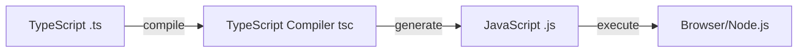

# Pendahuluan & Setup Lingkungan TypeScript

## Apa itu TypeScript?

TypeScript adalah bahasa pemrograman **open-source** yang dikembangkan oleh Microsoft sebagai **superset** dari JavaScript. Artinya, semua kode JavaScript yang valid juga merupakan kode TypeScript yang valid, tetapi TypeScript menambahkan fitur-fitur powerful di atasnya.

Fitur utama TypeScript adalah **static typing** (pengetikan statis), yang memungkinkan Anda menentukan tipe data variabel, parameter, dan return value saat menulis kode. Ini sangat berbeda dengan JavaScript yang menggunakan **dynamic typing**.

## Mengapa Menggunakan TypeScript?

**Type Safety** — Mendeteksi error sejak fase development, bukan saat runtime.

**Better Tooling** — IDE dapat memberikan autocomplete, refactoring, dan navigation yang jauh lebih baik.

**Dokumentasi Otomatis** — Tipe data berfungsi sebagai dokumentasi yang selalu akurat.

**Maintainability** — Kode lebih mudah dibaca dan di-maintain dalam proyek skala besar.

**Modern JavaScript Features** — TypeScript mendukung fitur-fitur JavaScript terbaru (ES2024) bahkan untuk target browser lama.

## Perbedaan Utama: TypeScript vs JavaScript

### Static Typing vs Dynamic Typing

```typescript
// JavaScript - error baru ketahuan saat runtime
function tambah(a, b) {
  return a + b;
}
tambah(5, "10"); // "510" (string concatenation) 😱

// TypeScript - error langsung terdeteksi saat development
function tambah(a: number, b: number): number {
  return a + b;
}
tambah(5, "10"); // ❌ Error: Argument of type 'string' is not assignable to parameter of type 'number'
```

### Compilation Process

TypeScript tidak berjalan langsung di browser atau Node.js. Kode TypeScript harus di-**compile** (transpile) menjadi JavaScript biasa terlebih dahulu.



## Setup Lingkungan Development

### Langkah 1: Install Node.js dan npm

Node.js diperlukan untuk menjalankan TypeScript compiler.

1. Kunjungi [nodejs.org](https://nodejs.org)
2. Download versi **LTS** (Long-Term Support) — versi paling stabil
3. Install dengan mengikuti wizard instalasi
4. Verifikasi instalasi:

```bash
node --version  # Harus menampilkan versi, misalnya v20.10.0
npm --version   # Harus menampilkan versi, misalnya 10.2.3
```

### Langkah 2: Membuat Proyek TypeScript Pertama

Buat folder baru untuk proyek:

```bash
mkdir belajar-typescript
cd belajar-typescript
```

Inisialisasi proyek npm:

```bash
npm init -y
```

Ini akan membuat file `package.json` yang mengelola dependencies proyek.

Install TypeScript sebagai development dependency (lokal ke proyek):

```bash
npm install --save-dev typescript
```

### Langkah 3: Membuat Konfigurasi TypeScript (`tsconfig.json`)

File `tsconfig.json` adalah jantung dari proyek TypeScript — mengontrol bagaimana TypeScript compiler bekerja.

Generate file konfigurasi default:

```bash
npx tsc --init
```

Buka `tsconfig.json` dan sesuaikan dengan konfigurasi best practice 2025:

```json
{
  "compilerOptions": {
    /* Language and Environment */
    "target": "ES2022", // JavaScript version target
    "lib": ["ES2022", "DOM"], // Library APIs yang tersedia, hapus "DOM" jika tidak berinteraksi dengan browser

    /* Modules */
    "module": "commonjs", // Module system (commonjs untuk Node.js)
    "rootDir": "./src", // Folder source code
    "moduleResolution": "node", // Cara resolve module

    /* Emit */
    "outDir": "./dist", // Folder output hasil compile
    "removeComments": true, // Hapus comment di output
    "sourceMap": true, // Generate .map file untuk debugging

    /* Type Checking - STRICT MODE (RECOMMENDED!) */
    "strict": true, // Enable semua strict type checking
    "noImplicitAny": true, // Error jika ada 'any' implisit
    "strictNullChecks": true, // null/undefined harus explicit
    "strictFunctionTypes": true, // Function type checking lebih ketat
    "strictPropertyInitialization": true, // Property class harus diinisialisasi
    "noImplicitThis": true, // 'this' harus punya tipe explicit
    "alwaysStrict": true, // Emit "use strict" di output

    /* Additional Checks */
    "noUnusedLocals": true, // Error jika ada variabel lokal tidak terpakai
    "noUnusedParameters": true, // Error jika ada parameter tidak terpakai
    "noImplicitReturns": true, // Semua code path harus return value
    "noFallthroughCasesInSwitch": true // Case di switch harus ada break/return
  },
  "include": ["src/**/*"], // File mana yang di-compile
  "exclude": ["node_modules", "dist"] // File mana yang diabaikan
}
```

**Penting**: Setting `"strict": true"` sangat direkomendasikan untuk proyek baru. Ini mengaktifkan semua pengecekan tipe yang ketat untuk menghindari bug.

### Langkah 4: Struktur Folder Proyek

Buat struktur folder yang clean:

```
belajar-typescript/
├── src/              # Source code TypeScript (.ts)
│   └── index.ts
├── dist/             # Compiled JavaScript (akan dibuat otomatis)
├── node_modules/     # Dependencies
├── package.json
└── tsconfig.json
```

Buat folder `src`:

```bash
mkdir src
```

### Langkah 5: Hello World TypeScript!

Buat file `src/index.ts`:

```typescript
// src/index.ts
function sapa(nama: string): string {
  return `Halo, ${nama}! Selamat belajar TypeScript! 🚀`;
}

const namaSaya: string = "Budi";
console.log(sapa(namaSaya));

// Coba uncomment baris di bawah - TypeScript akan error!
// console.log(sapa(123)); // ❌ Error: Argument of type 'number' is not assignable to parameter of type 'string'
```

**Compile** kode TypeScript menjadi JavaScript:

```bash
npx tsc
```

Perintah ini akan:

- Membaca semua file `.ts` di folder `src/`
- Compile menjadi `.js` di folder `dist/`
- Menampilkan error jika ada masalah tipe data

**Jalankan** kode JavaScript hasil compile:

```bash
node dist/index.js
```

Output:

```
Halo, Budi! Selamat belajar TypeScript! 🚀
```

### Langkah 6: Watch Mode untuk Development

Agar tidak perlu compile manual setiap kali edit kode, gunakan **watch mode**:

```bash
npx tsc --watch
```

Sekarang TypeScript compiler akan otomatis re-compile setiap kali Anda menyimpan file `.ts`!

### Langkah 7: Setup npm Scripts (Opsional tapi Recommended)

Edit `package.json` dan tambahkan scripts:

```json
{
  "scripts": {
    "build": "tsc",
    "dev": "tsc --watch",
    "start": "node dist/index.js"
  }
}
```

Sekarang Anda bisa menjalankan:

```bash
npm run build   # Compile sekali
npm run dev     # Watch mode
npm start       # Jalankan hasil compile
```

## Type Safety dalam Aksi

Mari lihat kekuatan TypeScript dengan contoh praktis:

```typescript
// src/index.ts
interface User {
  id: number;
  nama: string;
  email: string;
  aktif: boolean;
}

function tampilkanUser(user: User): void {
  console.log(`ID: ${user.id}`);
  console.log(`Nama: ${user.nama}`);
  console.log(`Email: ${user.email}`);
  console.log(`Status: ${user.aktif ? "Aktif" : "Nonaktif"}`);
}

const pengguna: User = {
  id: 1,
  nama: "Andi Wijaya",
  email: "andi@example.com",
  aktif: true,
};

tampilkanUser(pengguna);

// Coba buat user dengan property yang salah
const penggunaError: User = {
  id: 2,
  nama: "Budi",
  // email: "budi@example.com",  // ❌ Error: Property 'email' is missing
  aktif: "yes", // ❌ Error: Type 'string' is not assignable to type 'boolean'
};
```

TypeScript akan mendeteksi error **sebelum** kode dijalankan!

## Ringkasan

**TypeScript = JavaScript + Static Types** — Memberikan type safety dan tooling yang lebih baik.

**Setup Workflow** — Install Node.js → Init project → Install TypeScript → Configure `tsconfig.json` → Write `.ts` → Compile → Run `.js`.

**Strict Mode** — Selalu gunakan `"strict": true"` untuk type checking maksimal.

**Development Workflow** — Gunakan watch mode (`tsc --watch`) untuk auto-compile.

## Latihan Praktik

Buat file `src/kalkulator.ts` dengan fungsi-fungsi berikut:

```typescript
function tambah(a: number, b: number): number {
  // Implementasikan penjumlahan
}

function kurang(a: number, b: number): number {
  // Implementasikan pengurangan
}

function kali(a: number, b: number): number {
  // Implementasikan perkalian
}

function bagi(a: number, b: number): number {
  // Implementasikan pembagian
  // Bonus: Tangani kasus pembagian dengan 0
}

// Test fungsi-fungsi di atas
console.log(tambah(10, 5)); // 15
console.log(kurang(10, 5)); // 5
console.log(kali(10, 5)); // 50
console.log(bagi(10, 5)); // 2
```

Jika sudah silahkan Compile

```bash
npx tsc
```

Kemudian, jalankan untuk memastikan semuanya bekerja!

```bash
node dist/kalkulator.js
```
